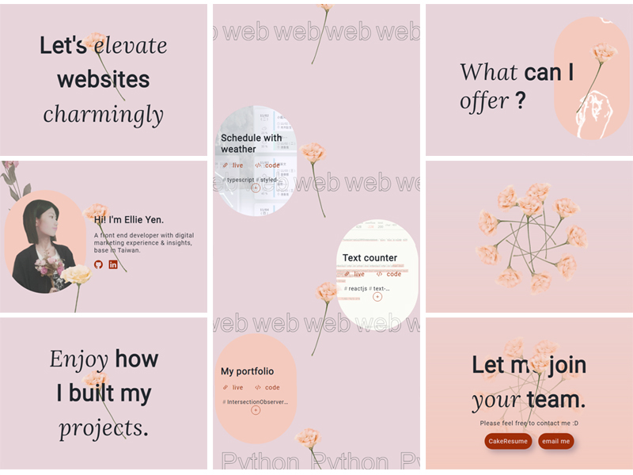

# My-Portfolio

## Hope you will enjoy it.
&#128204; [live demo link](https://ellie-yen.github.io/)

<video width="800" controls>
  <source
    src="demo/demo_portfolio_1.mp4"
    type="video/mp4">

  Your browser doesn't support HTML5 video tag.
</video>
(there're more demostrations in the last part.)

* description:  
My portfolio with abundant interacting effects by typographical design.
Build by react with webpack.

* techs:
 * Use *styled-component* to create responsive values for css attributes by different props / className and speed up layout design.
 * The scrolling effect, lazy-loading and some animations are controlled by using *IntersectionObserver API*, *useRef* and *useEffect* together. They 're triggered when and only when the target elements are in the view (or vice versa); thus increasing the performance.

* source and liscense:
  * [styled-component](https://styled-components.com/)
  * Source and license of icon: [Bootstrap](https://getbootstrap.com/).
  * Source and license of pictures: [pexels](https://www.pexels.com/).

* demostrations
## lazy-loading
<video width="800" controls>
  <source
    src="demo/demo_portfolio_2.mp4"
    type="video/mp4">

  Your browser doesn't support HTML5 video tag.
</video>

## scroll effect
<video width="800" controls>
  <source
    src="demo/demo_portfolio_3.mp4"
    type="video/mp4">

  Your browser doesn't support HTML5 video tag.
</video>

## RWD layouts

.png)
.png)

