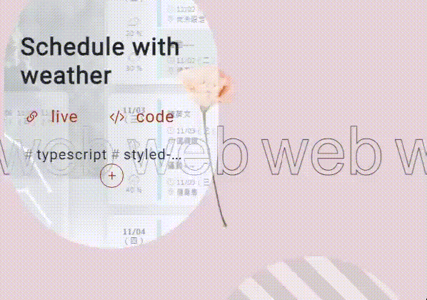

# My-Portfolio

## Hope you will enjoy it.
&#128204; [live demo link](https://ellie-yen.github.io/)

(there're more demostrations in the last part.)

* description:  
My portfolio with abundant interacting effects by typographical design.
Build by react with webpack.

* techs:
 * Use *styled-component* to create responsive values for css attributes by different props / className and speed up layout design.
 * The scrolling effect, lazy-loading and some animations are controlled by using *IntersectionObserver API*, *useRef* and *useEffect* together. They 're triggered when and only when the target elements are in the view (or vice versa); thus increasing the performance.

* source and liscense:
  * [styled-component](https://styled-components.com/)
  * Source and license of icon: [Bootstrap](https://getbootstrap.com/).
  * Source and license of pictures: [pexels](https://www.pexels.com/).

* demostrations
## lazy-loading

## scroll effect

## RWD layouts

